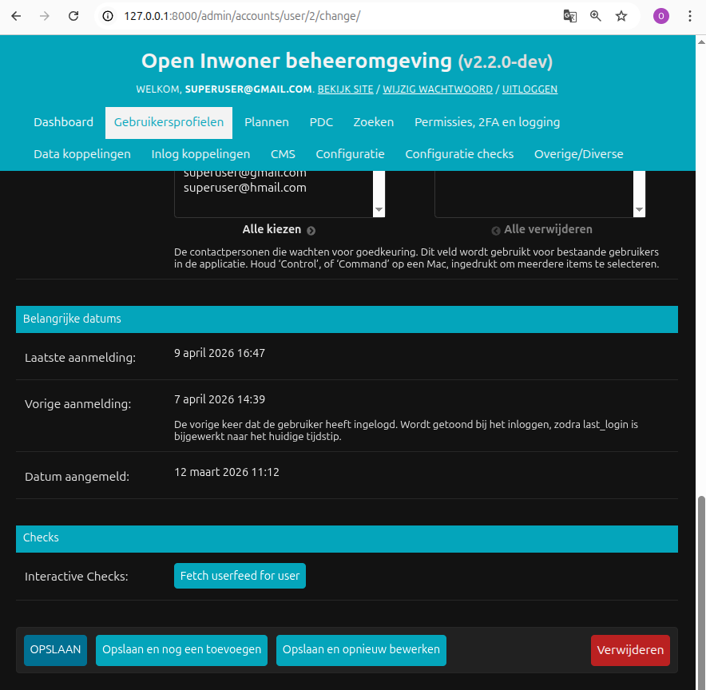
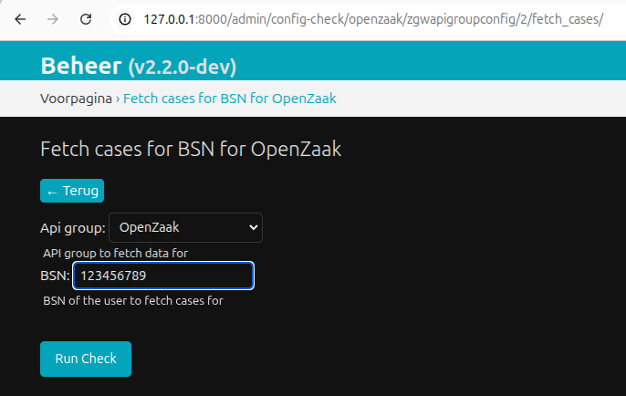
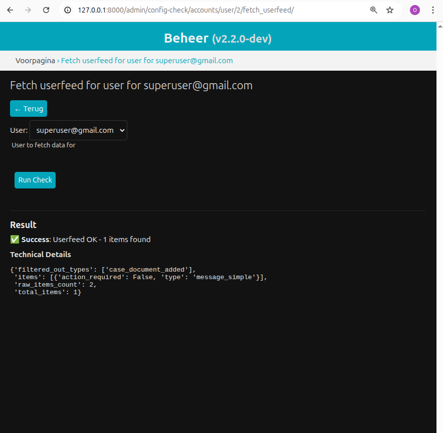

===========
Quick start
===========

Requirements
============

* Python 3.12 or above
* Django 4.2 or newer

Install
=======

.. code-block:: bash

    pip install maykin-config-checks

Add ``maykin_config_checks`` to the Django ``INSTALLED_APPS``:

.. code-block:: python

    INSTALLED_APPS = [
        ...
        "maykin_config_checks",
        ...
    ]

URL configuration
=================

To expose the interactive configuration checks in the Django admin,
the URL patterns provided by the library must be included in your
project's URL configuration.

Add the following to your ``urls.py``:

.. code-block:: python

    from django.urls import include, path

    urlpatterns = [
        ...
        path("admin/config-check/", include("maykin_config_checks.urls")),
    ]

This registers the endpoints used by interactive configuration checks,
such as::

    /admin/config-check/<app_label>/<model_name>/<check_identifier>/

Usage
=====

The library supports **two types of configuration checks**:

* **Standard checks** – executed automatically and require no user input.
* **Interactive checks** – executed manually from the Django admin and may require user input.

Standard checks are typically used for automated health monitoring,
while interactive checks are useful for diagnostics and manual validation
of integrations or configuration.

Implementing checks
-------------------

This library is based on the following components:

* The :class:`HealthCheck` which implements the logic of a particular configuration check.
* The :class:`HealthCheckResult`, which is the result of running a :class:`HealthCheck`.
  It contains information about whether the check succeeded and additional information in case the check failed.
* The :func:`run_checks`, which runs all the :class:`HealthCheck` that are retrieved by a collector
  function and returns an iterable of :class:`HealthCheckResult`.

You can see dummy implementations of all of these components below:

.. literalinclude:: ../testapp/checks.py
    :language: python

Interactive configuration checks
--------------------------------

Interactive checks are executed manually from the Django admin and can collect input
parameters from the user through a check-specific form. The library handles all the
boilerplate: exposing URLs, admin integration, permission enforcement, form validation,
and reporting results back to the user.

Many checks cannot be defined statically — they depend on runtime context provided by
the administrator. For example, verifying that a case management system (zaaksysteem) is
correctly configured often requires more than a connectivity check: you may also need to
query it for real data, which means supplying a subject identifier (such as a BSN) at
the time of the check.
Configuration problems also tend to have interaction effects. A setting may look correct
in isolation but fail when combined with the state of the backend system — for instance,
an API key that is valid but lacks the permissions needed to access a particular resource,
or a filter that returns no results for the test subject chosen. Because both sides of the
integration affect the outcome, you need a fast feedback loop: run a check, adjust the
configuration, and run it again without leaving the admin.

Typical use cases include:

* verifying connectivity with an external API and confirming the credentials have the
  required permissions (not just that the endpoint is reachable)
* fetching real records from a backend service for a given subject — e.g. retrieving
  cases for a specific BSN to confirm the full request/response cycle works end-to-end
* validating the configuration of a specific object, such as an API group, to catch
  misconfigured fields that only surface when used together
* checking that a notification or webhook destination accepts a test event and
  acknowledges it correctly
* confirming that a search index or filter returns expected results for a known input,
  catching issues with permissions, scoping, or data availability

Defining an interactive check
-----------------------------

An interactive check is defined as a class with the following attributes:

* ``identifier`` – unique identifier of the check. This value must be URL-friendly
  (similar to a slug), as it is used as part of the admin URL for executing the check.
* ``label`` – human-readable name displayed in the admin
* ``form_class`` – Django form used to gather input from an admin user
* ``required_permissions`` – optional list of permission classes that control whether
  the current user is allowed to execute the check.
* ``get_form_kwargs`` – optional classmethod that allows customizing the keyword
  arguments used when instantiating the form. This method is called before the form
  is rendered. If the check is executed from a Django ``ModelAdmin`` instance,
  the corresponding model instance will be passed as the ``obj`` argument.

Example:

.. code-block:: python

    from maykin_config_checks import GenericHealthCheckResult

    class FetchCasesCheck:
        identifier = "fetch_cases"
        label = "Fetch cases for BSN"
        form_class = FetchCasesParams
        required_permissions = [IsStaffUser(), HasModelRead()]

        @classmethod
        def get_form_kwargs(cls, obj=None):
            """
            Customize the initial form arguments. If invoked from a model admin,
            ``obj`` will be the model instance.
            """
            initial = {}

            if obj:
                initial["api_group"] = obj

            return {"initial": initial}

        def run(self, form: FetchCasesParams, obj: Model | None = None) -> GenericHealthCheckResult:
            bsn = form.cleaned_data["bsn"]

            try:
                cases = zgw_client.fetch_cases(bsn)

                return GenericHealthCheckResult(
                    identifier=self.identifier,
                    verbose_name=self.label,
                    success=True,
                    message=f"Successfully retrieved {len(cases)} cases.",
                    extra={"cases_found": len(cases)},
                )

            except Exception as exc:
                return GenericHealthCheckResult(
                    identifier=self.identifier,
                    verbose_name=self.label,
                    success=False,
                    message="Failed to fetch cases from the backend service.",
                    extra={"error": str(exc)},
                )

Form definition
---------------

Interactive checks use a standard Django form to collect input parameters.

Example:

.. code-block:: python

    from django import forms

    class FetchCasesParams(forms.Form):
        api_group = forms.CharField(
            required=False,
            help_text="API group to query"
        )

        bsn = forms.CharField(
            label="BSN",
            help_text="BSN of the user to fetch cases for"
        )

Permissions
-----------

The ``required_permissions`` attribute accepts a list of permission class instances.
All permissions in the list must pass for the check to be accessible. If the attribute
is omitted, the default behaviour requires the user to be an active staff member.

Each permission class implements the :class:`BasePermission` interface:

* ``has_permission(request, obj)`` – returns ``True`` if the user may run the check.
* ``get_error_message(obj)`` – returns the message shown when permission is denied.

.. note::

   ``obj`` is the model instance the check is invoked from, but it may be ``None``
   when the check is executed in standalone mode (i.e. not from a specific admin
   object). Permission classes must handle this case explicitly.

Available permission classes
~~~~~~~~~~~~~~~~~~~~~~~~~~~~

``IsStaffUser``
  Passes if the user is an active Django staff member (``is_active`` and
  ``is_staff``). This is the implicit default when no permissions are defined.

``IsSuperUser``
  Passes only for superusers. Use this to restrict sensitive checks that should
  never be delegated.

``HasPermission(perm)``
  Passes if the user has the named Django permission, e.g.
  ``HasPermission("myapp.view_apicredentials")``. The permission string follows
  the standard ``"<app_label>.<codename>"`` format.

``HasModelRead(model=None)``
  Passes if the user has the **view** permission for the given model. When ``obj``
  is available the model is inferred from it automatically; pass ``model`` explicitly
  when the check may run in standalone mode and ``obj`` could be ``None``.

``HasModelWrite(model=None)``
  Passes if the user has the **change** permission for the given model. Same
  ``obj``/``model`` rules apply as for ``HasModelRead``.

Example
~~~~~~~

.. code-block:: python

    from maykin_config_checks.permissions import IsSuperUser, HasPermission, HasModelWrite

    class FetchCasesCheck:
        identifier = "fetch_cases"
        label = "Fetch cases for BSN"
        form_class = FetchCasesParams
        required_permissions = [
            IsSuperUser(),
            HasPermission("myzgwapp.run_diagnostics"),
            HasModelWrite(model=ZGWApiGroup),  # explicit model in case obj is None
        ]

Exposing checks in the admin
----------------------------

Checks can be attached to a Django ``ModelAdmin`` using the
``with_config_checks`` decorator.

.. code-block:: python

    from django.contrib import admin
    from maykin_config_checks import with_config_checks

    @admin.register(User)
    @with_config_checks(FetchUserfeedCheck)
    class UserAdmin(admin.ModelAdmin):
        readonly_fields = ("config_check_links",)

The decorator automatically adds a read-only field containing links
to run the configured checks for the object.

Example in the Django admin:

Customizing the admin field name
~~~~~~~~~~~~~~~~~~~~~~~~~~~~~~~~

The name of the generated admin field can be customized using the
``field_name`` keyword argument.

This is useful if you want to integrate the checks into an existing
admin layout or use a more descriptive field name.

.. code-block:: python

    @admin.register(User)
    @with_config_checks(FetchUserfeedCheck, field_name="health_checks")
    class UserAdmin(admin.ModelAdmin):
        readonly_fields = ("health_checks",)

Running checks
--------------

Interactive checks can be executed through a dedicated admin page
that renders a form to collect input parameters.

Example of the interactive check form:

After submitting the form, the result of the check is displayed:

Interactive checks can be executed in two ways.

**From a model instance**

Example URL::

    /admin/config-check/accounts/user/3/fetch_userfeed/

Parameters:

* ``app_label``
* ``model_name``
* ``pk``
* ``check_id``

**Standalone execution**

Checks can also be executed without a model instance.

The URL for executing an interactive check follows the pattern:

::

    /admin/config-check/<app_label>/<model_name>/<check_identifier>/

For example::

    /admin/config-check/openzaak/zgwapigroupconfig/fetch_cases/

In practice, it is recommended to resolve the URL using a helper
function instead of constructing it manually.

Example:

.. code-block:: python

    from config_checks import get_interactive_config_check_url

    get_interactive_config_check_url(FetchCasesCheck)

In this case the form must allow the user to select the target object.

Signals
-------

Two signals are emitted when interactive checks run.

``interactive_config_check_pre_run``

Sent immediately before executing the check.

Arguments:

* ``request``
* ``check_class``
* ``obj``
* ``form``

``interactive_config_check_post_run``

Sent after the check has finished.

Arguments:

* ``request``
* ``check_class``
* ``obj``
* ``form``
* ``result``

Example receiver:

The primary use cases for these signals is to facilitate logging and auditability of the config check execution.

.. code-block:: python

    from django.dispatch import receiver
    from maykin_config_checks.signals import interactive_config_check_post_run

    @receiver(interactive_config_check_post_run)
    def log_interactive_check(sender, request, check_class, obj, result, **kwargs):
        logger.info(f"{check_class.identifier} executed with result: {result.success}")

Error handling
--------------

When an interactive configuration check raises an exception during execution,
the library catches the exception and converts it into a failed
:class:`GenericHealthCheckResult`.

The error message is rendered and displayed to the admin user on the
check result page so that configuration problems can be diagnosed
directly from the Django admin interface.

Example:

.. code-block:: python

    class FetchCasesCheck:
        identifier = "fetch_cases"
        label = "Fetch cases for BSN"
        form_class = FetchCasesParams

        def run(self, form, obj=None):
            bsn = form.cleaned_data["bsn"]

            try:
                cases = zgw_client.fetch_cases(bsn)

                return GenericHealthCheckResult(
                    identifier=self.identifier,
                    verbose_name=self.label,
                    success=True,
                    message=f"Successfully retrieved {len(cases)} cases.",
                )

            except Exception as exc:
                return GenericHealthCheckResult(
                    identifier=self.identifier,
                    verbose_name=self.label,
                    success=False,
                    message="An error occurred while fetching cases.",
                    extra={"error": str(exc)},
                )

Logging errors
~~~~~~~~~~~~~~

The provided signals can be used to log the outcome of configuration
checks or integrate them with an auditing system.

Example:

.. code-block:: python

    from django.dispatch import receiver
    from maykin_config_checks.signals import interactive_config_check_post_run

    @receiver(interactive_config_check_post_run)
    def log_interactive_check(sender, request, check_class, obj, result, **kwargs):
        logger.info(f"{check_class.identifier} executed with result: {result.success}")

View
----

To have an API view that returns the results of the performed health checks,
add the following to the ``urlpatterns``:

.. literalinclude:: ../testapp/urls.py
    :language: python

Where the argument ``checks_collector`` is a ``Callable[[], Iterable[HealthCheck]]``. It is used to retrieve which health checks should
be performed by the view. You can also add the view multiple times to the ``urlpatters`` with different ``checks_collector`` arguments
if you want to have multiple health check views that run different checks.

Management command
------------------

There is also a management command that can be used to run health checks from the CLI.

.. code-block:: bash

    django-admin health_checks --checks-collector dotted.path.to.checks_collector_fn
